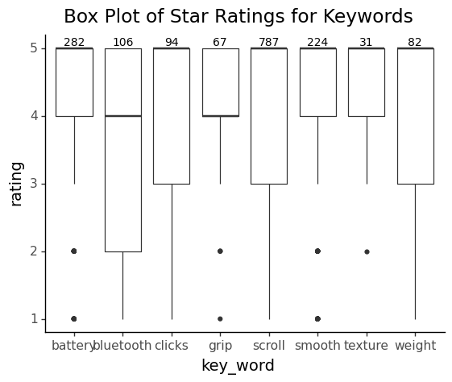
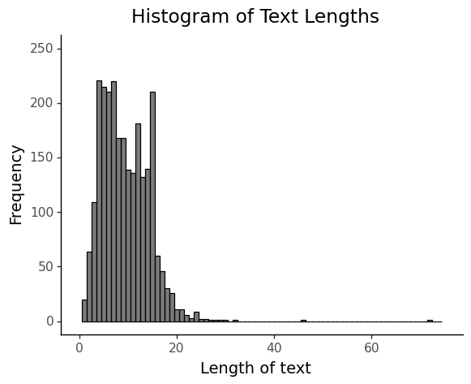
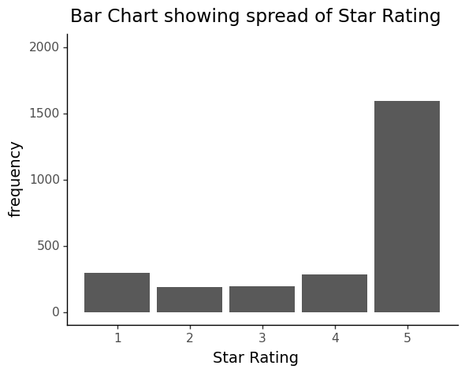
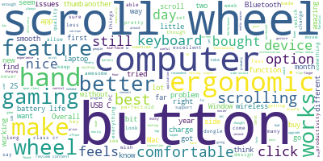
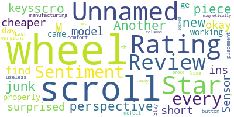
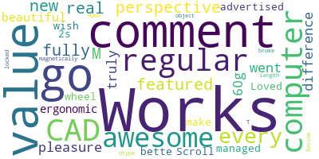
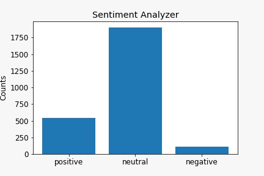
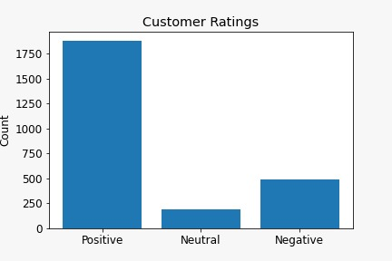
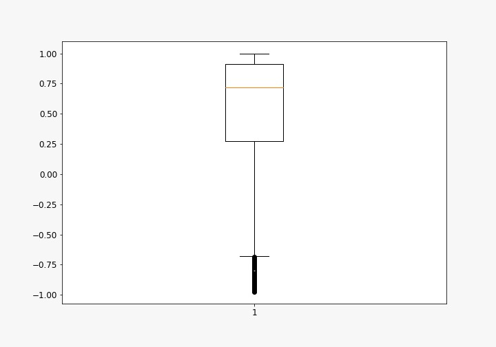
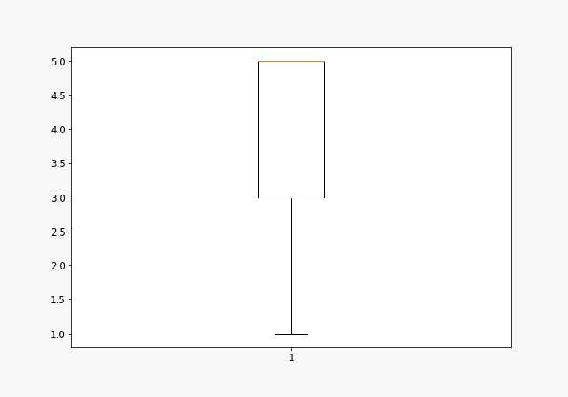

# **Data Dimensions**
{: .fs-7 }

The dataset summarizing Logitech MX Master 3 Amazon reviews is a two-dimensional matrix with 4 data elements representing each column, and 2,560 unique reviews representing each row. 

| Rows - Data Elements       | Columns - Review Count          |
|:---------------------------|:--------------------------------|
|  2,549                     |  4                              | 

# **Data Appearance**
{: .fs-7 }

| Reviewer Name | Star Rating | Review                                                               | Review Dates       |
|:--------------|:------------|:---------------------------------------------------------------------|:-------------------|
| ak01          | 4           | My favorite mouse of all time.                                       | December 7, 2022   |
| KC5           | 5           | I bought this as an alternative to my usual trackball and like it.   | October 31, 2022   |
| Joey          | 2           | Sensor of mouse isn't working properly from day one                  | September 13, 2022 |
| PE            | 5           | I love the shape of the mouse and how the fit just feels so natural. | November 15, 2022  |
| Johnny        | 5           | Super quiet clicks. LOVE IT!!!                                       | August 11, 2022    |

The data contains the variables Reviewer Name,Star Rating,Review and Review Dates and above is the general appearance of the cleaned csv file of all of our data with 4 columns and 2539 rows. The most relevant variable Star Rating ranges from values of 1 to 5, Review Dates starts from Oct 27th 2019 up until the Present and Review Length technically ranges up to 5000 words.

# **Descriptive Data Analytics**
{: .fs-7 }

The quickest identifiable feature of every review is its star rating which is on a higher-is-better 5-point scale. The distribution for this product listing, and nearly every reputable listing on Amazon for that matter, is J-shaped, with an overwhelming majority of ratings falling in the 5- and 4-star category ranges. 

# **Boxplots**
{: .fs-7 }

[Python Link](https://github.com/dveksler02/dveksler02.github.io/blob/4032316c3ec44a54f1f7a536f9adbd3ba852d03f/python/Boxplots_DS105.ipynb)

While investigating our dataset we realized that the data we were looking at was one dimensional in nature, so this meant that exploring correlation between a feature and star-rating was practically impossible as we did not have two independent variables to utilize. With these limitations, we found methods of analysis and visualization for data with just one dimension. This led us to creating code to visualize our data in the form of boxplots which look at the star rating of reviews under instances in which a specific keyword is mentioned and above each respective boxplot we can see the number of reviews in which the keyword was mentioned. We picked these words as our key words because they were identified as the main features on the Amazon product listing of the mouse.  

Further looking into the visualization of our data it is evident to see by the central tendency or distribution of median rating (specified by the bold horizontal line) that our data has a J-shaped distribution with a majority of 4- or 5- star reviews. This reality is further strengthened both by the spread within our boxplots which can be seen through the interquartile ranges in most cases being around 4-5 rating and that in some cases outliers exist in where the rating is 1 or 2 indicating that instances of users rating the Logitech mouse low are in fact quite rare when certain keywords are mentioned in the review.  

# **Histogram**
{: .fs-7 }

[Python Link](https://github.com/dveksler02/dveksler02.github.io/blob/08062ea73c43998fb78d926a9fceda121ed80097/python/Historgram_DS105.ipynb)

As seen in the histogram above the distribution of the word lengths has a positive skew with the average number of words being near the 0-to-20-word count. While there is the argument this may not be useful for figuring out customer preferences as we have less data to work with, there is the caveat that the shorter comments will only contain the most important criticisms or compliments about the Logitech mouse. Below is an example of where a shorter review gives us a clearer indication of comments on the mouse which we can analyze as opposed to a longer comment: 

| Nick G                     |  love all the features. Especially the thumb scroll. Great product.          |
|:---------------------------|:-----------------------------------------------------------------------------|
|  JK                        |          Summary: Mouse is twitchy, mis-clicks and has the worst software I've used it regularly causes me to click-drag-copy files in Windows and lowering its sensitivity means I have to swipe too much, to get the mouse across my two screens.  No, I'm not new to using mice and I own a 10k dpi gaming mouse that I have no problems with.  And before you suggest I adjust the dpi, I should point out that "Options", the Logitech software for Windows (which has almost no options, ironically) doesn't allow the user to change the dpi or mouse polling rate.  There's only a sensitivity setting, like Windows 10 already has. But that's just a minor complaint.  The main problems are the mouse-wheel, which is touted as an improvement over normal wheels, but feels more like a really bad automatic transmission; always scrolling WAY to far, or not far enough.  And since they replaced the normal mechanism, you can't turn it off, but without the feature enabled, the wheel response is terribly sluggish. The biggest trigger for me, however, has to be the button design for the two main buttons...                                                               |  

# **Bar Chart**
{: .fs-7 }

[Python Link](https://github.com/dveksler02/dveksler02.github.io/blob/08062ea73c43998fb78d926a9fceda121ed80097/python/Star_Rating_DS105.ipynb)

By looking at the distribution of star ratings in the form of bar charts (as seen above) it was evident to see that the spread of our data took the form of a J-shaped distribution characterised by a semi-large number of low values suddenly increasing in frequency with high 5-star ratings. This can be seen by the large peak towards the upper end of the distribution.  

# **Word Clouds**
{: .fs-7 }

[Python Link](https://github.com/dveksler02/dveksler02.github.io/blob/main/python/NPL-wordclouds-DS105.ipynb)
This is the WordCloud generated from all the reviews, it shows the most frequent words describing the characteristics and features of the product mentioned in customer reviews. 

Due to the J-distribution of the ratings, to help potential buyers to understand more about the product that cannot be seen on Amazon, we generated two separate Word Clouds one containing positive aspects and the other negative. This helps customers to learn about the positive and negative aspects of the product in order to aid their purchasing descions. 

[Python Link](https://github.com/dveksler02/dveksler02.github.io/blob/08062ea73c43998fb78d926a9fceda121ed80097/python/Star_Rating_DS105.ipynb)

[Python Link](https://github.com/dveksler02/dveksler02.github.io/blob/08062ea73c43998fb78d926a9fceda121ed80097/python/Star_Rating_DS105.ipynb)

# **Sentiment Analysis**
{: .fs-7 }

We used the Sentiment Intensity Analyzer from NLTK to analyze and score customer reviews’ sentiments on a scale from –1 to 1, with –1 being the most negative and 1 absolutely positive. We found that most reviews’ sentiment are actually neutral rather than positive.  

Now printing the first 5 rows we can see that each review has a column on star rating as well as the sentiment scores: positive, negative and neutral.

| Unnamed: | Reviewer Name | Star Rating  | 
|:---------|:--------------|:-------------|
| 0        | ak01          | 4            |
| 1        | KC5           | 5            |
| 2        | Joey          | 2            |
| 3        | PE            | 5            |
| 4        | Johnny        | 5            |

| Review                                            | Review Dates     | 
|:--------------------------------------------------|:-----------------|
| I cannot comment on the value of this mouse as... | December 7, 2022 |
| Use for regular computer work and CAD. Works a... | December 6, 2022 |
| This mouse is great from every perspective, bu... | December 5, 2022 |
| This fully featured mouse is a real pleasure t... | December 5, 2022 |
| I went from a 60g mouse to this thing and the...  | December 4, 2022 |

| Positive  | Negative  | Neutral   | 
|:----------|:----------|:----------|
| 0.149     | 0.083     | 0.768     |
| 0.372     | 0.076     | 0.552     |
| 0.121     | 0.218     | 0.660     |
| 0.358     | 0.000     | 0.642     |
| 0.196     | 0.000     | 0.804     |

{: .fs-7 }

Visualizing this finding in the bar charts below, where “Sentiment Analyzer” shows the reviews’ sentiment score while the “Customer Ratings” shows the actual star ratings. In the first bar chart, most customer reviews’ sentiment scores as graded neutral, while from the same customers rated the mouse positive (4-5 stars). The discrepancy between the review texts sentiment and the star ratings suggest that many of the positive reviews could be neutral and the star ratings very likely does not reflect the true customer opinion. 

[Python Link](https://github.com/dveksler02/dveksler02.github.io/blob/main/python/NPL-Sentiment%20Analysis-DS105.ipynb)

Using data.describe() function allows us to look at the statistical properties of the 2 distributions - ratings and sentiment scores. 

|      | Unnamed: 0  | Star Rating |  Positive    | Negative    |  Neutral  |
|:-----|:------------|:------------|:-------------|:------------|:----------|
| count| 2554.000000 | 2554.000000 |  2554.000000 |2554.000000  |2554.000000|
| mean | 1279.005873 | 4.048160    |  0.212965    |0.043112     |0.743931   |
| std  | 738.631841  | 1.428965    |  0.181152    | 0.064534    | 0.169663  |
| min  | 0.000000    | 1.000000    |  0.000000    | 0.000000    | 0.000000  | 
| 25%  | 640.250000  | 3.000000    |  0.091000    | 0.000000    | 0.674000  |
| 50%  | 1279.500000 | 5.000000    |  0.167000    | 0.015500    | 0.777000  |
| 75%  | 1917.750000 | 5.000000    |  0.287000    | 0.067000    | 0.851000  |
| max  | 2558.000000 | 5.000000    |  1.000000    | 0.650000    | 1.000000  |

Through comparing statistical properties of the two distributions using data.describe() function, we created two boxplots to summarize the statistical characteristics of both the sentiment scores of reviews and the customer ratings. This helps Amazon buyers who are thinking of buying a Logitech mouse and give them more information on the possible bias of star ratings which most buyers use as a reference of the quality of the product. We think the distribution of sentiment score ratings are a more accurate reflection of customer opinions.  

**This is the boxplot for sentiment scores:**
{: .fs-7 }

**This is the boxplot for star ratings:**
{: .fs-7 }

 
We can see the mean of the sentiment score distribution is roughly 0.75, contrasting with the star ratings distribution’s 5.0 (5/5). This suggests to the potential buyers that the overall satisfaction is still high, just not as high as the star ratings distribution, which is shown on the Amazon product page, shows.  
 
Another feature is the interquartile range (IQR) of the sentiment distribution is smaller than the ratings distribution, this suggests that the sentiment scores of the customers – the proxy for quality and satisfaction of the product – is very consistent. And as the IQR lies on the top part of the plot, it seems to suggest the product satisfaction rate is consistently good. 
